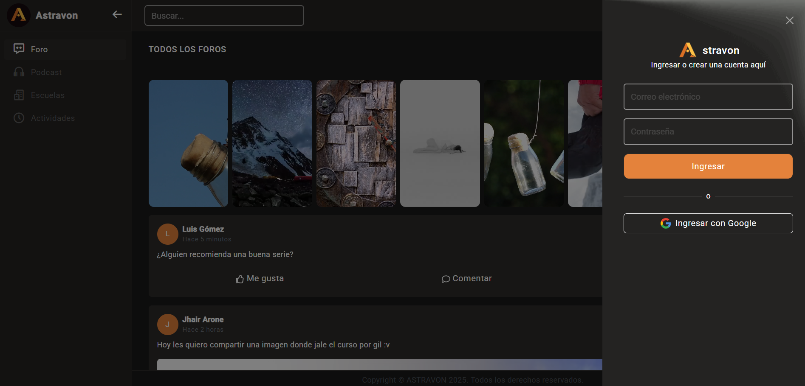

<div align="center">
    <a href="https://github.com/jheysonjhairpro/app-react-vite-astravon">
      
    </a>
    <h1>JhairDev - ASTRAVON</h1>
    <p align="center">
        Full Stack Developer Jhair
    </p>
</div>



# Sistema de ASTRAVON

Bienvenido ala **WEB de ASTRAVON**, una aplicación frontend diseñada para gestionar cursos...

## Tecnologías Utilizadas

- **React**: Biblioteca principal utilizada para desarrollar la interfaz de usuario.
- **TypeScript**: Lenguaje utilizado para tipado estático y mejor mantenimiento del código.
- **Bootstrap**: Framework de CSS utilizado para crear una interfaz responsiva y moderna.
- **Vite**: Herramienta de construcción que optimiza el desarrollo y mejora el rendimiento de la aplicación.

---

## Instalación

1. **Requisitos previos**:
   - Tener instalado **Node.js** y **npm** en tu sistema.
   - Back-end:

    ```bash
    git clone https://github.com/Edsghot/

2. **Clonar el repositorio**:
   ```bash
   git clone https://github.com/jheysonjhairpro/app-react-vite-astravon
   cd app_react_client_gym-dragons

    ```

3. **Ejecuta el comando `npm run dev` para iniciar el servidor de desarrollo.**
    
    ```bash
    npm run dev
    ```

4. **Abre tu navegador y visita `http://localhost:5173`.**

¡Listo! Ahora puedes comenzar a trabajar en el Sistema sin problemas.


